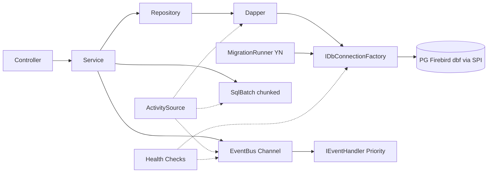

# Footing.Framework

[](https://www.nuget.org/packages/Footing.Framework) [](https://github.com/edertelhado/Footing.Framework/actions) [](LICENSE) [](https://edertelhado.github.io/Footing.Framework/)

> **Sapata .NET não-invasiva** — fundação para apps que precisam de EventBus, Data Layer dinâmico e Migrations SQL puras sem carregar um framework pesado.

**Footing.Framework** resolve 6 dores reais de apps com PostgreSQL, Firebird ou dbf legado, sem impor ORM, broker ou scaffolding: desacoplamento via EventBus in-process, queries dinâmicas com Dapper agnóstico, DI auto-scan leve, lifecycle ordenado, migrations embarcadas SQL-97 e resiliência via SPI.

---

## Por que Footing?

**Use se:**
*   precisa desacoplar módulos sem Rabbit/Kafka
*   queries dinâmicas com `WHERE/IF/IN/CHOOSE` sem ORM pesado
*   migrations versionadas embarcadas (`*.sql` como `EmbeddedResource`)
*   codebase legado Firebird/dbf + PostgreSQL no mesmo binário
*   quer `TryAdd` — só o que registrar existe (inspirado Spring Boot auto-configuration)

**Não use se:**
*   precisa scaffolding full-stack, multi-tenancy pronto ou admin UI — Footing é sapata, não casa pronta.

---

## Features

*   **⚡ EventBus** — `Channel<T>` bounded, `Publish/PublishAsync`, `IEventHandler<T>` + `[EventListener(Priority)]`, workers paralelos
*   **🗄️ SqlTemplate** — 11 tags `IF/WHERE/IN/CHOOSE/BETWEEN/TRIM/SET/INCLUDE/BIND/IFDEFINED` + `length()/defined()` — SQL puro em `*.sql`
*   **📦 SqlBatch** — `INSERT VALUES` chunked `500 + 2100/colCount` agnóstico `PG/MySQL/SQLite/Firebird/dbf`
*   **🔍 DI Walk** — `AddDependencyWalk` determinístico por assembly, sem Source Generator
*   **♻️ Lifecycle & Config** — `[PostConstruct]/[PreDestroy]` + `[InjectConfig("Smtp:Host")]`
*   **🗃️ Migrations** — `AddMigrations(Assembly)` SQL-97 `EmbeddedResource`, `DefaultMigrationJournal` `CHAR(1) Y/N`, `Migrate/Validate/Repair/Baseline/GenerateScript`
*   **🛡️ Resiliência SPI** — `IIdempotencyStore` + `IOutboxStore` via `TryAdd` — pluga `Redis/Npgsql/Firebird/dbf` fora do `src/`
*   **🔭 Observabilidade** — `FootingActivitySource` OTel + `AddFootingHealthChecks` `/health`

---

## Quickstart — 3 comandos

```bash
dotnet add package Footing.Framework
```

```csharp
// Program.cs
using Footing.Framework.DI;
using Footing.Framework.Data;

var builder = WebApplication.CreateBuilder(args);

builder.Services.AddDependencyWalk("MeuProjeto", builder.Configuration, typeof(Program).Assembly);
builder.Services.AddSingleton<IDbConnectionFactory>(new NpgsqlConnectionFactory(builder.Configuration.GetConnectionString("Default")!));
builder.Services.AddEventBus(o => { o.WorkerCount = 4; o.Capacity = 1000; });
builder.Services.AddMigrations(o => o.EmbeddedAssembly = typeof(Program).Assembly);
builder.Services.AddFootingHealthChecks();
builder.Services.AddOpenTelemetry().WithTracing(b => b.AddSource("Footing.Framework"));

var app = builder.Build();
app.MapHealthChecks("/health");
app.Run();

public sealed class NpgsqlConnectionFactory(string cs) : IDbConnectionFactory {
  public System.Data.IDbConnection CreateConnection() => new Npgsql.NpgsqlConnection(cs);
}
```

```csharp
// Repository — SQL em arquivo, Dapper direto
public class UserRepository(IDbConnectionFactory f) {
  public async Task<IEnumerable<User>> Search(string? name) {
    using var conn = f.CreateConnection();
    var tpl = SqlTemplateLoader.For<UserRepository>("Sql.Users.Search");
    var r = tpl.Render(new { Name = name });
    return await conn.QueryAsync<User>(r.Sql, r.Parameters);
  }
}
// Sql/Users/Search.sql (EmbeddedResource)
// SELECT * FROM users {WHERE} {IF:Name} AND name LIKE @Name {END} {ENDWHERE}
```

---

## Arquitetura



Princípios: agnóstico a banco (`0 Npgsql/Firebird/OleDb` no `src/`), SPI `IOutboxStore/IIdempotencyStore/IMigrationJournal` — quem precisa pluga, `<3.5K LOC`, fail-fast de estrutura vs fail-safe de dados.

---

## Documentação completa

*   [Quickstart](docs/modules/ROOT/pages/quickstart.adoc) — instalação + Hello World
*   [Arquitetura](docs/modules/ROOT/pages/arquitetura.adoc) — camadas e fluxo
*   [EventBus](docs/modules/ROOT/pages/eventbus.adoc) — publish/subscribe + prioridade
*   [SqlTemplate](docs/modules/ROOT/pages/data-sqltemplate.adoc) — 11 tags com SQL antes/depois
*   [SqlBatch](docs/modules/ROOT/pages/data-sqlbatch.adoc) — batch agnóstico
*   [DI & Lifecycle](docs/modules/ROOT/pages/di-lifecycle.adoc) — auto-scan + PostConstruct
*   [Migrations](docs/modules/ROOT/pages/migrations.adoc) — EmbeddedResource SQL-97
*   [Resiliência SPI](docs/modules/ROOT/pages/resiliencia-spi.adoc) — Idempotency/Outbox
*   [Observabilidade](docs/modules/ROOT/pages/observability.adoc) — OTel + Health

---

## Requisitos

*   .NET 10.0+
*   Dapper 2.1.72
*   Microsoft.Extensions.* 10.0.8

## Licença

MIT — ver [LICENSE](LICENSE).

> Autor: **Eder Rafael Telhado** — [@edertelhado](https://github.com/edertelhado) · [CapybaraInfo](https://github.com/CapybaraInfo) · `edertelhado@outlook.com.br`
