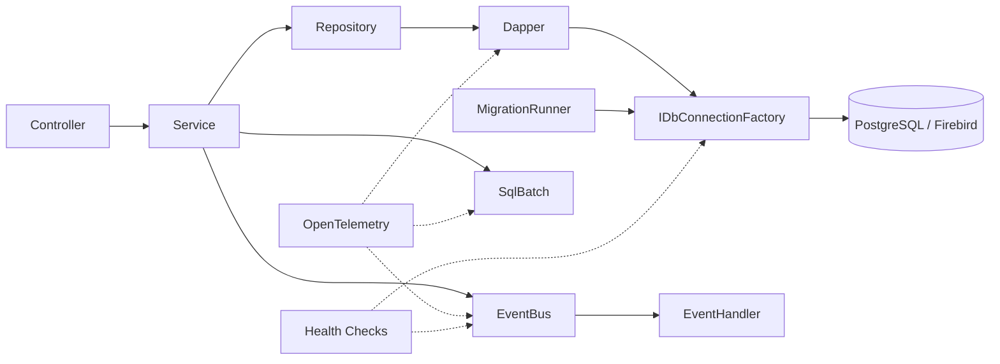

# Footing.Framework

[](https://www.nuget.org/packages/Footing.Framework)
[](https://github.com/edertelhado/Footing.Framework/actions)
[](LICENSE)
[](https://edertelhado.github.io/Footing.Framework/)

> **Uma sapata .NET para sistemas reais.**
>
> Infraestrutura pequena e pragmática para aplicações que precisam de EventBus, SQL dinâmico, migrations e componentes de infraestrutura sem adotar um framework inteiro.

O **Footing.Framework** fornece peças de infraestrutura para aplicações .NET que precisam continuar simples, previsíveis e controláveis.

Ele não tenta substituir ASP.NET, Dapper ou seu banco de dados. Ele fica entre a aplicação e essas tecnologias, resolvendo problemas recorrentes de infraestrutura sem impor ORM, broker, scaffolding ou arquitetura pesada.

Funciona especialmente bem em sistemas que misturam código novo com legado, múltiplos bancos ou SQL explícito.

## O que você ganha

* **EventBus in-process** com `Channel<T>`, workers paralelos e prioridade de handlers.
* **SQL dinâmico** usando arquivos `.sql` e templates simples, sem ORM.
* **Batch SQL** com chunking automático para inserts em massa.
* **DI auto-scan** determinístico por assembly.
* **Lifecycle** com `PostConstruct` e `PreDestroy`.
* **Configuração por atributo** com `InjectConfig`.
* **Migrations SQL** embarcadas como `EmbeddedResource`.
* **SPI para infraestrutura externa**, permitindo conectar PostgreSQL, Firebird, Redis etc. sem contaminar o core.
* **OpenTelemetry** através de `ActivitySource`.
* **Health Checks** integrados ao pipeline do ASP.NET.

Tudo isso permanece opcional. Você registra apenas o que sua aplicação realmente utiliza.

## Quando usar

Footing faz sentido quando você precisa de uma base de infraestrutura para aplicações como:

* sistemas corporativos;
* APIs e serviços internos;
* aplicações que utilizam SQL diretamente;
* sistemas legados modernizados gradualmente;
* aplicações que precisam trabalhar com PostgreSQL, Firebird, MySQL ou SQLite;
* sistemas onde Dapper é suficiente, mas ainda faltam algumas peças de infraestrutura.

É especialmente útil quando a alternativa seria criar novamente o mesmo conjunto de componentes em cada projeto.

## Quando não usar

Footing não é um framework full-stack.

Não fornece:

* scaffolding de aplicação;
* ORM;
* painel administrativo;
* autenticação pronta;
* multi-tenancy;
* message broker;
* arquitetura obrigatória;
* geração de código;
* abstrações para esconder completamente o banco de dados.

A ideia é simples:

> **Footing fornece infraestrutura. A aplicação continua sendo sua.**

---

# Quickstart

Instale o pacote:

```bash
dotnet add package Footing.Framework
```

Registre os componentes necessários:

```csharp
using Footing.Framework.Data;
using Footing.Framework.DI;

var builder = WebApplication.CreateBuilder(args);

builder.Services.AddDependencyWalk(
    "MeuProjeto",
    builder.Configuration,
    typeof(Program).Assembly
);

builder.Services.AddSingleton<IDbConnectionFactory>(
    new NpgsqlConnectionFactory(
        builder.Configuration.GetConnectionString("Default")!
    )
);

builder.Services.AddEventBus(options =>
{
    options.WorkerCount = 4;
    options.Capacity = 1000;
});

builder.Services.AddMigrations(options =>
{
    options.EmbeddedAssembly = typeof(Program).Assembly;
});

builder.Services.AddFootingHealthChecks();

builder.Services
    .AddOpenTelemetry()
    .WithTracing(tracing =>
    {
        tracing.AddSource("Footing.Framework");
    });

var app = builder.Build();

app.MapHealthChecks("/health");

app.Run();
```

A aplicação continua responsável pelas decisões de negócio.

---

# SQL sem ORM

O Footing não tenta esconder SQL.

Você mantém as queries em arquivos `.sql` e utiliza Dapper para executar o resultado.

### Repository

```csharp
public sealed class UserRepository(IDbConnectionFactory factory)
{
    public async Task<IEnumerable<User>> Search(string? name)
    {
        using var connection = factory.CreateConnection();

        var template =
            SqlTemplateLoader.For<UserRepository>("Sql.Users.Search");

        var rendered = template.Render(new
        {
            Name = name
        });

        return await connection.QueryAsync<User>(
            rendered.Sql,
            rendered.Parameters
        );
    }
}
```

### SQL

`Sql/Users/Search.sql`

```sql
SELECT
    id,
    name,
    email
FROM users

{WHERE}
    {IF:Name}
        AND name LIKE @Name
    {END}
{ENDWHERE}
```

O SQL continua sendo SQL.

O template apenas resolve a parte dinâmica.

Isso evita espalhar `StringBuilder`, concatenação de SQL e dezenas de métodos diferentes para variações da mesma consulta.

## SqlTemplate

O mecanismo suporta tags como:

```text
IF
WHERE
IN
CHOOSE
BETWEEN
TRIM
SET
INCLUDE
BIND
IFDEFINED
```

Além de funções como:

```text
defined()
length()
```

A renderização produz SQL e parâmetros separados, mantendo o uso normal do Dapper.

[Documentação do SqlTemplate](docs/modules/ROOT/pages/data-sqltemplate.adoc)

---

# EventBus

Para comunicação entre módulos dentro do mesmo processo, nem sempre é necessário RabbitMQ ou Kafka.

O Footing fornece um EventBus baseado em `Channel<T>`:

```csharp
public sealed record UserCreated(long UserId);

public sealed class SendWelcomeEmailHandler
    : IEventHandler<UserCreated>
{
    public Task Handle(UserCreated message)
    {
        // ...
        return Task.CompletedTask;
    }
}
```

Publicação:

```csharp
await eventBus.PublishAsync(
    new UserCreated(user.Id)
);
```

Os handlers podem definir prioridade:

```csharp
[EventListener(Priority = 100)]
public sealed class AuditHandler
    : IEventHandler<UserCreated>
{
    // ...
}
```

O processamento utiliza workers configuráveis e capacidade limitada, evitando crescimento ilimitado da fila em memória.

[Documentação do EventBus](docs/modules/ROOT/pages/eventbus.adoc)

---

# DI sem magia

O `AddDependencyWalk` percorre os assemblies configurados e registra as dependências encontradas automaticamente.

```csharp
builder.Services.AddDependencyWalk(
    "MeuProjeto",
    builder.Configuration,
    typeof(Program).Assembly
);
```

A descoberta é determinística por assembly, sem source generators ou mágica.

---

# Lifecycle e configuração

Componentes podem participar do ciclo de vida através de atributos:

```csharp
[PostConstruct]
public void Initialize()
{
    // ...
}

[PreDestroy]
public void Shutdown()
{
    // ...
}
```

Configuração pode ser injetada diretamente:

```csharp
[InjectConfig("Smtp:Host")]
public string Host { get; set; } = default!;
```

Isso cobre casos simples sem exigir uma hierarquia inteira de classes de configuração.

[Documentação de DI e Lifecycle](docs/modules/ROOT/pages/di-lifecycle.adoc)

---

# Migrations SQL

As migrations são arquivos SQL normais armazenados como `EmbeddedResource`.

Exemplo:

```text
Migrations/
├── V001__Create_users.sql
├── V002__Create_orders.sql
└── V003__Add_user_email.sql
```

Registro:

```csharp
builder.Services.AddMigrations(options =>
{
    options.EmbeddedAssembly = typeof(Program).Assembly;
});
```

Operações disponíveis:

```text
Migrate
Validate
Repair
Baseline
GenerateScript
```

O mecanismo mantém um journal próprio e não exige ORM.

A implementação utiliza SQL compatível com o subconjunto definido pelo projeto para manter o core independente do banco.

[Documentação de Migrations](docs/modules/ROOT/pages/migrations.adoc)

---

# SQL Batch

Para inserções em massa, `SqlBatch` divide automaticamente os dados em lotes.

A estratégia padrão considera:

```text
500 registros
```

e o limite de parâmetros da instrução:

```text
2100 / quantidade de colunas
```

Isso permite trabalhar com diferentes provedores sem amarrar o core a PostgreSQL, Firebird ou outro banco específico.

---

# SPI para infraestrutura

Dependências específicas de infraestrutura ficam fora do core.

O Footing define contratos como:

```csharp
IIdempotencyStore
IOutboxStore
IMigrationJournal
IDbConnectionFactory
```

Implementações concretas vivem em projetos separados:

```text
Footing.Framework
        │
        ├── PostgreSQL
        ├── Firebird
        ├── Redis
        └── outros providers
```

O assembly principal não referencia nenhum driver específico — cada aplicação escolhe seu provider.

O padrão é:

> **O framework define o contrato. A aplicação escolhe a implementação.**

Os registros utilizam `TryAdd` quando apropriado, permitindo que a aplicação substitua a implementação padrão.

[Documentação de Resiliência e SPI](docs/modules/ROOT/pages/resiliencia-spi.adoc)

---

# Observabilidade

O Footing expõe um `ActivitySource` próprio para integração com OpenTelemetry.

```csharp
builder.Services
    .AddOpenTelemetry()
    .WithTracing(tracing =>
    {
        tracing.AddSource("Footing.Framework");
    });
```

Os principais componentes podem produzir traces sem exigir que a aplicação conheça a implementação interna.

Também existe integração com ASP.NET Health Checks:

```csharp
builder.Services.AddFootingHealthChecks();

app.MapHealthChecks("/health");
```

[Documentação de Observabilidade](docs/modules/ROOT/pages/observability.adoc)

---

# Arquitetura



A arquitetura segue alguns princípios simples:

### Banco agnóstico

O core não depende diretamente de PostgreSQL, Firebird, MySQL ou SQLite.

### SQL explícito

Queries continuam sendo SQL.

### SPI em vez de acoplamento

Integrações específicas são implementadas fora do core.

### Componentes independentes

Você pode utilizar apenas:

```text
EventBus
SqlTemplate
Migrations
DI
Health Checks
```

sem precisar adotar todo o restante.

### Fail-fast para estrutura

Problemas de configuração ou estrutura devem falhar cedo.

### Fail-safe para dados

Operações de infraestrutura devem evitar comprometer o processo inteiro quando uma falha recuperável puder ser isolada.

---

# Estrutura do projeto

A intenção é manter o core pequeno.

```text
Footing.Framework
├── EventBus
├── Data
│   ├── SqlTemplate
│   └── SqlBatch
├── DI
├── Lifecycle
├── Migrations
├── Resilience
└── Observability
```

A implementação principal permanece abaixo de aproximadamente **3.500 linhas de código**, mantendo o projeto auditável e fácil de entender.

---

# Requisitos

* .NET 10.0+
* Dapper 2.1.72
* Microsoft.Extensions.* 10.0.8

O projeto não obriga um banco específico nem um ORM específico.

---

# Documentação

A documentação completa está disponível em:

**https://edertelhado.github.io/Footing.Framework/**

Principais capítulos:

* [Quickstart](docs/modules/ROOT/pages/quickstart.adoc)
* [Arquitetura](docs/modules/ROOT/pages/arquitetura.adoc)
* [EventBus](docs/modules/ROOT/pages/eventbus.adoc)
* [SqlTemplate](docs/modules/ROOT/pages/data-sqltemplate.adoc)
* [SqlBatch](docs/modules/ROOT/pages/data-sqlbatch.adoc)
* [DI & Lifecycle](docs/modules/ROOT/pages/di-lifecycle.adoc)
* [Migrations](docs/modules/ROOT/pages/migrations.adoc)
* [Resiliência & SPI](docs/modules/ROOT/pages/resiliencia-spi.adoc)
* [Observabilidade](docs/modules/ROOT/pages/observability.adoc)

---

# Filosofia

O Footing não tenta ser:

```text
"mais um framework que resolve tudo"
```

A proposta é outra:

```text
.NET
 │
 ├── ASP.NET
 ├── Dapper
 ├── banco de dados
 │
 └── Footing.Framework
       ├── EventBus
       ├── SQL Template
       ├── Batch
       ├── Migrations
       ├── DI
       └── infraestrutura
```

Ele existe para resolver a infraestrutura repetitiva que normalmente acaba sendo copiada entre projetos.

Pouca abstração.

SQL explícito.

Componentes pequenos.

Dependências opcionais.

E nenhuma obrigação de adotar uma arquitetura específica.

---

# Licença

MIT — consulte [LICENSE](LICENSE).

**Eder Rafael Telhado**

[@edertelhado](https://github.com/edertelhado) · [CapybaraInfo](https://github.com/CapybaraInfo) · `edertelhado@outlook.com.br`
